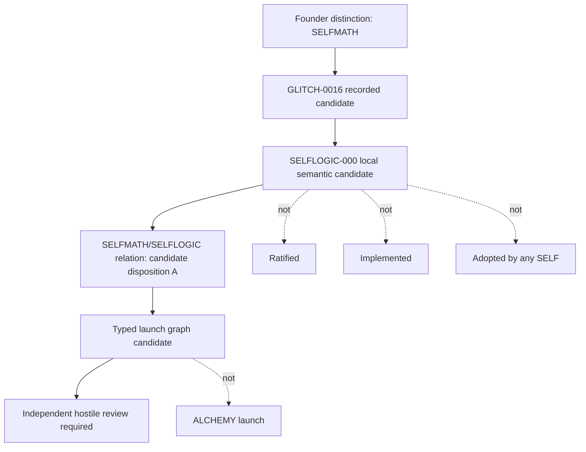
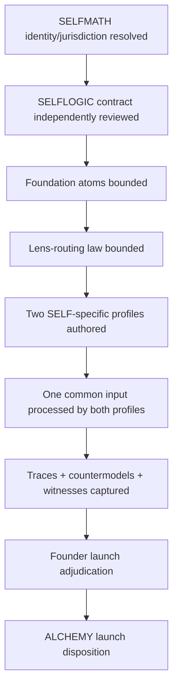

# SELFMATH-000 - Reality Handoff and Alchemy Launch Manifestation Graph v0.1 Candidate

status: SEMANTIC_CANDIDATE
standing:
  - FOUNDER_TRANSMITTED_CONTEXT_BOUND
  - NOT_RATIFIED
  - NOT_IMPLEMENTED
  - NOT_LAUNCHED
  - NOT_ADOPTED
runtime: CODEXSELF
receiving_session_identity: independent Codex runtime session, not the producing CHATGPTSELF session
authority_source: AUTHORIZE_SELFMATH_000_REALITY_BINDING_AND_ALCHEMY_LAUNCH_MANIFESTATION_GRAPH_ONLY
scope: reality binding, identity adjudication, typed manifestation graph, launch predicate, pilot recommendation, falsification plan, bounded custody
control_effect: NONE beyond this candidate custody event
runtime_implementation_effect: NONE
ecosystem_adoption_effect: NONE
ratification_effect: NONE
commit_effect: custody only
push_effect: linked GitHub inspection only

## 0. Receiving-Session Independence Statement

This artifact is authored by the receiving `CODEXSELF` session. It observes a
Founder-transmitted handoff produced by `CHATGPTSELF`, but it does not claim
direct observation of the prior runtime's private context, hidden reasoning, or
session mechanics.

```text
ArtifactObservation != OriginalRuntimeObservation
ContextTransfer != ProtocolAdoption
SharedFounderIntent != SharedRuntimeReality
```

This session accepts the handoff as Founder-supplied context and binds only the
semantic laws, source references, and bounded authorization explicitly present in
the handoff.

## 1. Source Reality Verification

### 1.1 Handoff input

Source:

```text
/Users/millysituated/.codex/attachments/cc209396-558a-4878-9399-981453dc7d68/pasted-text.txt
```

Observed:

```text
line_count: 1036
sha256: fd9ed4553a1b690659d91def43d839d735ba442c26db8a2261237c7acbc0f5c7
standing: FOUNDER_TRANSMITTED_CONTEXT
authorization_token: AUTHORIZE_SELFMATH_000_REALITY_BINDING_AND_ALCHEMY_LAUNCH_MANIFESTATION_GRAPH_ONLY
```

The handoff authorizes only:

```text
DISCOVERY
+ SEMANTIC GRAPH MANIFESTATION
+ ONE PRIMARY CANDIDATE ARTIFACT
+ ONE DIRECT EVIDENCE RECORD
+ BOUNDED COMMIT
+ BOUNDED PUSH
```

It explicitly forbids implementation, profile registry creation, propagation,
launch, adoption, merge, PR creation, and foreign-lane mutation.

### 1.2 Local SELFLOGIC candidate

Source:

```text
/Users/millysituated/RUORA/governance/SELFLOGIC-000-MATHEMATICAL-FOUNDATION-ATOMS-AND-LENS-ROUTING-v0.1-CANDIDATE.md
```

Observed:

```text
line_count: 676
byte_count: 28830
sha256: a8448f855c4e5a4578c2b793514399fe6c291aac00b963aebb90fe80a415679d
reported_digest_match: YES
standing: SEMANTIC_CANDIDATE / NOT_COMMITTED / NOT_PUSHED / NOT_INDEPENDENTLY_REVIEWED / NOT_RATIFIED / NOT_IMPLEMENTED
```

The local SELFLOGIC candidate was verified as input only. It was not staged,
modified, committed, moved, or repaired in this gate.

### 1.3 GitHub GLITCH-0016 lineage witness

Claimed witness:

```text
repo: situaedmilly/ruora
branch: governance/ourself
commit: a0c455301a3e58a6da4f1f493a8ebc787e071ea7
path: governance/notepad/entries/GLITCH-0016-SELFLOGIC-MATHEMATICAL-TOTALIZATION.md
```

Observed:

```text
commit_exists: YES
commit_subject: Record SELFLOGIC mathematical-alchemy totalization glitch
artifact_blob: 37b10d34d5cdf62ca59bfd9da992217a6be6adc8
artifact_size: 3739
artifact_sha256: d06e01437ae210a8963cc0ed7c749d3c6c6833c23ce2a22d64cc11e5087af815
source_native_standing: RECORDED_CANDIDATE
control_effect: NONE
ratification_effect: NONE
mutation_authority: NONE
```

The remote `governance/ourself` branch has advanced after the cited commit. The
cited commit remains the witness identity for this gate.

## 2. Prime Binding

This session is not beginning SELFMATH from zero.

Current witnessed reality:

```text
Founder mathematical distinction exists.
GLITCH-0016 exists in linked GitHub custody.
SELFLOGIC-000 v0.1 candidate exists locally.
No SELFMATH canonical identity is yet established.
No independent hostile review of SELFLOGIC-000 is complete.
No SELFLOGIC profile registry exists.
No lens-routing runtime exists.
No existing SELF has adopted SELFLOGIC.
No ALCHEMY launch has occurred.
```

Primary law:

```text
ALL MATHEMATICS AVAILABLE != ALL MATHEMATICS APPLIED TO EVERY INPUT
```

Root authority law:

```text
MATHEMATICS MAY CONSTRAIN WHAT FOLLOWS FROM PREMISES.
MATHEMATICS DOES NOT DECIDE WHO HAD AUTHORITY TO CHOOSE THE PREMISES.
```

## 3. SELFMATH / SELFLOGIC Identity Disposition

Disposition selected:

```text
A. SELFMATH IS THE MANIFESTATION; SELFLOGIC IS ITS CONSTITUTIONAL CONTRACT
```

More exact candidate form:

```text
SELFMATH
= Founder-designated manifestation lane for OURSELF's mathematical foundation.

SELFLOGIC
= candidate governed semantic contract through which a SELF atomizes, types,
  routes, derives, falsifies, and exposes mathematical structure before output.
```

Why not identity collapse:

- `SELFMATH` is the Founder-facing manifestation lane and may eventually include
  profiles, pilots, review gates, launch witnesses, and cross-SELF adoption law.
- `SELFLOGIC-000` is the current contract candidate inside that lane.
- There is no evidence that SELFMATH has an independent canonical organ,
  repository, runtime, or ratified constitution.
- There is no evidence that SELFLOGIC is merely an implementation subsystem.

Therefore:

```text
SELFMATH != SELFLOGIC
SELFLOGIC candidate_for SELFMATH constitutional contract
```

This preserves future Founder authority to revise the relation after hostile
review.

## 4. Bounded Mathematical Lineage Map

| System / manifestation | Mathematical phenotype | Exact artifact observed | Semantic use | Jurisdiction / standing | Recurrence or lineage | Shared-foundation candidate | Project-specific law | Collision risk |
| --- | --- | --- | --- | --- | --- | --- | --- | --- |
| SELF Protocol | typed operation language, authority/evidence/continuity contracts | `systems/self-protocol-suite/specifications/SELF-PROTOCOL-SUITE-v0.md` | validates bounded computational language and evidence/authority separation | initial draft, not ratified | inherited non-collapse precedent | authority and evidence atoms | protocol primitives require Founder/version authority | SELFMATH must not add protocol primitives silently |
| SELF IR Core v0 | deterministic intent normalization, authority validation, no execution | `systems/self-protocol-suite/specifications/SELF-IR-CORE-v0.md`; `src/ir.js`; `test/ir.test.js` | proves a compact IR can validate structure without dispatch | draft/reference implementation | project-specific recurrence of atomization | type, transition, authority, constraint | IR normalization, not mathematical foundation | risk of confusing SELFIR with SELFMATH |
| Gene of SELFs | identity, non-identity, transition, authority, standing grammar | `governance/GENE-OF-SELFS-GENESIS-CONSTITUTION-v0.1-CANDIDATE.md` | provides Genesis necessity and authority-conditioned transition law | local semantic candidate | normative lineage | identity, transition, authority, standing atoms | SELFhood law | risk of letting math authorize Genesis |
| Foundation IR | representation-neutral invariant conservation | `governance/FOUNDATION-IR-INVARIANT-TRANSMUTATION-CONTRACT-v0.1-CANDIDATE.md` | distinguishes equivalence from identity and translation from amendment | local semantic candidate | normative/semantic lineage | invariant, equivalence, provenance atoms | representation transmutation law | risk SELFMATH becomes universal IR |
| ACTIMANIRUN | temporal graph projection, source admission, frequency, drift, witness windows | `governance/ACTIMANIRUN-000-SEMANTIC-INITIATION-v0.1.md` | proves live projection != source truth and activity != progress | local semantic candidate | semantic recurrence | time, state, evidence, uncertainty atoms | manifestation telemetry | risk SELFLOGIC trace counted as movement |
| NOTEPAD | context capture without authority | GLITCH-0016 and ACTIMANIRUN note law | stores distinction and candidate context | recorded candidate / candidate | source-trigger lineage | provenance, standing, evidence boundary | note != doctrine | risk note becomes axiom |
| HBCSELF | proof chamber, digest witness, differentiation pressure, fail-closed standing | `projects/hbc-html/compiler/*`; `projects/hbc-html/tests/*` | pressure/falsification pattern | implementation evidence, not SELFMATH authority | adversarial lineage | evidence, standing, countermodel pattern | compile/witness boundaries | risk pressure depth becomes truth |
| HYPEDU | no exact local canonical artifact verified | honest null except references in workflow/SELFLOGIC context | possible pressure-depth metadata | unresolved | not inherited | none yet | none yet | risk invented standing |
| OMR | manifestation registry schemas, relationships, evidence references | `projects/ourself-manifestation-registry/schemas/*.json` | typed graph/evidence relations | schema corpus | structural precedent | relation, evidence, provenance | registry schema law | risk SELFMATH replaces registry |
| OSM | system manifest topology and honest null projection | `systems/ourself-system-manifest/README.md`; schemas/build artifacts | graph projection and source truth separation | system artifact | structural precedent | relation, order, uncertainty | manifest compiler law | risk graph becomes source truth |
| AgentBridge | runtime state, locks, leases, time, heartbeats, witness packets | `projects/agent-bridge/runtime/runtime-self.js`; `timeself.js`; `execution-witness.js` | concurrency/time/firewall precedent | implementation/runtime artifact | operational recurrence | time, state, transition, authority | process != institution | risk heartbeat becomes progress |
| DATASELF / DIGESELF | no exact current runtime verified in this gate; AECHO/AEPACKET and ACTIMANIRUN future event fabric adjacent | AECHO doctrine and ACTIMANIRUN future references | future memory/event fabric candidate | partial/adjacent | held unresolved | information atom candidate | proof-to-memory boundaries | risk future integration treated as current dependency |
| SELFQUANT | uncertainty, probability spaces, causal evidence, unavailable observations | `/Users/millysituated/Projects/SELFQUANT-2026/selfquant/*` | probability/evidence/causal non-collapse | external project implementation evidence | independent phenotype with risk | measure, uncertainty, cause atoms | financial/method boundary | risk probability becomes standing or trade authority |
| SELFHTML | semantic contracts, representation strata, proof obligations | `governance/SELFHTML-REALITY-CONTRACT-SEMANTICS-001-v0.1-CANDIDATE.md`; `projects/hbc-html` | semantic graph and artifact witness precedent | local candidate, dirty source state preserved | semantic lineage | relation, state, evidence, invariant | interface semantics | risk interface semantics become universal |
| RCP | RealityIR/TargetIR, semantic equivalence, observable trace, source maps | `governance/OURSELF-REALITY-COMPILATION-PROTOCOL-v0.1-DRAFT.md`; RCP review corpus | representation and conformance precedent | draft/review corpus | strong semantic precedent | invariant, equivalence, trace, provenance | compiler/conformance law | risk SELFMATH duplicates RealityIR |

No row establishes common canonical origin by resemblance alone.

```text
StructuralRhyme != SharedCanonicalSource
Recurrence != Inheritance
```

## 5. Foundational Atom Analysis

Standing classes used here are local candidate classifications, not ecosystem
standing vocabulary.

| Atom | Definition | Necessity | Mathematical meaning | Institutional extension | Non-identities | Omission counterexample | Candidate standing |
| --- | --- | --- | --- | --- | --- | --- | --- |
| DISTINCTION | boundary by which one thing is not another | prevents collapse | set/type separation, predicate difference | doctrine/object separation | distinction != SELF | note becomes law by resemblance | UNIVERSAL |
| TYPE | admissible class of a claim/object/relation | prevents category errors | type systems, signatures | object standing class | type != identity | proof artifact treated as authority | UNIVERSAL |
| IDENTITY | criteria for same entity across change | governs continuity | equality, identity relation | SELF/manif identity | equivalence != identity | rename creates new SELF | UNIVERSAL |
| OBJECT | candidate bearer of properties in a model | needed for object-bearing domains | object/domain/codomain/entity | manifestation, artifact, SELF subject | object != source truth | category overcorrection erases subjects | CLASS_REQUIRED |
| RELATION | typed connection between subjects | needed for graph and logic structure | relation, morphism, edge | dependency, derivation, witness | relation != authority | edge creates transition permission | UNIVERSAL |
| STATE | condition at an observation/model boundary | needed for before/after | state space, valuation | institutional standing/status | state != movement | ACTIVE treated as moving | UNIVERSAL |
| TRANSITION | movement between states/types/standings | needed for change claims | transition relation, morphism, automaton step | creation, repair, launch | transition != ratification | path completion creates SELF | UNIVERSAL |
| TIME | ordering, duration, freshness, cadence | needed for currentness | temporal order, metric/time index | source freshness, pulse | timestamp != witness | stale note treated current | UNIVERSAL |
| INVARIANT | property preserved under transformation | needed for transmutation | invariant/equivalence-preserved property | constitutional conservation | invariant != field equality | representation change mutates law | UNIVERSAL |
| CONSTRAINT | rule limiting admissible states/claims | needed for fail-closed behavior | predicate, axiom, boundary | authority/firewall law | constraint != proof | forbidden cast allowed | UNIVERSAL |
| EQUIVALENCE | sameness under a declared relation | needed for translation | equivalence relation, isomorphism candidate | representation-neutral conservation | equivalence != identity | same trace considered same SELF | UNIVERSAL |
| ORDER | sequence, precedence, hierarchy, dependency | needed where sequencing matters | partial order, total order, preorder | gate order, priority, dependency | order != causation | later recognition rewrites creation | CLASS_REQUIRED |
| MEASURE | quantified value under unit/method | needed for quantitative domains | measure, metric, statistic | evidence score, count, confidence | measure != meaning | score asserted without unit | CLASS_REQUIRED |
| UNCERTAINTY | unresolved, probabilistic, unknown, stale, not evaluable | needed to avoid guesses | probability, unknown state, interval | HONEST_NULL, pending | unknown != false | missing source filled by model | UNIVERSAL |
| CAUSE | generative/explanatory relation | needed for causal claims | causal graph, SCM, intervention | claimed reason for mutation | correlation != cause | compression explains event | CLASS_REQUIRED |
| INFORMATION | distinction-bearing content | needed for memory/data contexts | information, entropy, encoding | evidence packet, AECHO, trace | information != authority | memory becomes axiom | UNIVERSAL_LIGHTWEIGHT |
| COMPUTABILITY | effective describability/executability under limits | needed for implementation feasibility | computability, complexity | runtime feasibility | computable != authorized | elegant non-executable theorem becomes plan | CLASS_REQUIRED |
| OBJECTIVE | intended target/telos | needed for manifestation claims | objective function, goal state | target reality | objective != proof | desire becomes evidence | CLASS_REQUIRED |
| EVIDENCE | admitted support for claim standing | needed for proof discipline | witness, proof object, observation | governed evidence ref | evidence != authority | witness ratifies doctrine | UNIVERSAL |
| AUTHORITY | permission/jurisdiction to choose premises or transition | needed for all governed action | deontic/authorization relation | Founder gate, role ceiling | capability != authority | model chooses premises | UNIVERSAL |
| PROVENANCE | source lineage/custody of claim/artifact | needed for trust and trace | source map, ancestry relation | digest, branch, author, source | provenance != truth | copied note becomes source | UNIVERSAL |
| STANDING | current accepted institutional/evidential status | needed for review stages | judgment state, status lattice | candidate, review, ratified | standing != activity | generated artifact becomes adopted | UNIVERSAL |

Atom attack result:

```text
No atom is ratified by enumeration.
No atom is rejected in this gate.
OBJECT, ORDER, MEASURE, CAUSE, COMPUTABILITY, OBJECTIVE are class-required, not universal-heavy.
INFORMATION is universal only at lightweight source/content level; information theory is not automatically routed.
Potential missing trace objects: PREMISE, SCOPE, MODEL, COUNTERMODEL.
Disposition: hold them as trace fields, not foundational atoms, until hostile review.
```

## 6. Lens-Family Analysis

| Lens family | Accepted inputs | Produced outputs | Required premises | Proof ceiling | Failure states | Authority effect |
| --- | --- | --- | --- | --- | --- | --- |
| Formal foundations | typed propositions, proof claims, consistency claims | derivation, contradiction, countermodel, undecidable status | declared axiom set and logic | formal validity relative to premises | missing axioms, type error, undecidable, unsound premises | NONE |
| Structure | graph/edge/order/topology/algebra/invariant claims | structural map, equivalence class, invariant map | domain/object/relation declaration | model-structural support | false equivalence, object erasure, topology overreach | NONE |
| State and change | workflow/runtime/transition/time claims | state trace, temporal obligation, transition legality surface | state space, transition rules | transition-model support | path as authority, heartbeat as progress | NONE |
| Evidence and uncertainty | evidence, probability, causal, measurement claims | distribution, confidence, causal caveat, unknown status | observation source, sampling/evidence model | evidence-relative support | probability as standing, correlation as causation | NONE |
| Coordination | multi-actor, contention, resource, scheduling claims | game/queue/flow/concurrency model | actors/resources/preferences/locks | coordination-model support | model activity as institutional progress | NONE |
| Domain-specific | domain-bound mathematical claims | bounded domain interpretation | domain theory and applicability | domain-limited support | domain law smuggled as universal | NONE |

Lens attack result:

```text
Lens registry is viable only as an extensible routing catalog.
Every lens must declare accepted inputs, output type, premises, proof ceiling,
failure states, computational constraints, and authority effect NONE.
No lens is universal merely because it is mathematically available.
```

## 7. SL0 / SL1 / SL2 Assessment

| Depth | Candidate assessment | Required correction |
| --- | --- | --- |
| SL0 universal atomization | SUFFICIENT if lightweight | must classify source, claim type, authority ceiling, uncertainty, and forbidden casts without invoking all lens families |
| SL1 selected lenses | SUFFICIENT as routing layer | every selected lens needs recorded routing reason; skipped relevant lens needs recorded reason |
| SL2 formal/hostile escalation | CHANGES_REQUIRED | escalation triggers must be explicit: canonical mutation, identity, authority, money, deployment, security, irreversible transition, lineage collision |

Depth law:

```text
EveryInput may receive SL0.
EveryInput must not invoke every lens.
RuntimePreference != EscalationAuthority.
```

## 8. SELFLOGIC Profile Semantics

Candidate profile shape:

```yaml
selflogic_profile:
  self_ref: <namespaced SELF or system>
  standing: CANDIDATE | REVIEWED | ADOPTED | REJECTED
  inherited_atoms: []
  required_lenses: []
  conditional_lenses: []
  prohibited_assumptions: []
  axiom_pack: []
  domain_theory: []
  evidence_model: []
  authority_model: []
  proof_thresholds: []
  countermodel_requirement: []
  uncertainty_policy: []
  computational_budget: []
  trace_obligation: []
```

Profile laws:

```text
ProfileExists != ProfileRatified
ProfileRoute != SourceTruth
ProfileCapability != Authority
ProfileFit != UniversalFit
```

No SELFLOGIC profile is created by this gate.

## 9. Typed Manifestation Graph Law

The graph below is a candidate manifestation graph. Node and relation
vocabulary is local to this artifact. It is not ratified as universal ontology.

Every edge carries:

```text
relation
source
target
source_native_standing
evidence_refs
authority_effect
unresolved_conditions
```

Standing law:

```text
GraphEdge != Dependency
GraphInclusion != Ratification
CandidateRelation != CurrentAuthority
PotentialRelation != PresentDependency
```

## 10. Typed Manifestation Graph

| Edge | Source node | Relation | Target node | Source-native standing | Evidence refs | Authority effect | Unresolved conditions |
| --- | --- | --- | --- | --- | --- | --- | --- |
| E01 | Founder mathematical distinction | CANDIDATE_FOR | SELFMATH manifestation lane | Founder-transmitted context | handoff input | none | SELFMATH identity not ratified |
| E02 | GLITCH-0016 | DERIVED_FROM | SELFLOGIC-000 local candidate | RECORDED_CANDIDATE | commit `a0c4553`; blob `37b10d...` | none | branch advanced after witness commit |
| E03 | SELFLOGIC-000 local candidate | CANDIDATE_FOR | SELFMATH constitutional contract | SEMANTIC_CANDIDATE | sha256 `a8448f...` | none | independent hostile review required |
| E04 | SELFMATH lane | DISTINGUISHED_FROM | SELFLOGIC contract | CANDIDATE | this artifact | none | Founder may revise |
| E05 | SELFMATH lane | DISTINGUISHED_FROM | Foundation IR | CANDIDATE | Foundation IR candidate | none | relation unresolved after review |
| E06 | SELFMATH lane | DISTINGUISHED_FROM | Gene of SELFs | CANDIDATE | Gene candidate | none | math cannot authorize Genesis |
| E07 | SELFMATH lane | DISTINGUISHED_FROM | SELFIR | CANDIDATE | SELF IR/RCP artifacts | none | SELFIR relation needs review |
| E08 | Foundation atoms | DEFINES | SL0 atomization | CANDIDATE | SELFLOGIC-000, GLITCH-0016 | none | atom set hostile review |
| E09 | Lens registry | ROUTES_TO | SL1 selected lenses | CANDIDATE | SELFLOGIC-000, handoff | none | router semantics unreviewed |
| E10 | Escalation triggers | REQUIRES | SL2 formal/hostile review | CANDIDATE | handoff | none | trigger thresholds unresolved |
| E11 | Authority firewall | CONSTRAINS | lens outputs | CANDIDATE | GLITCH-0016; SELFLOGIC-000 | none | evidence class review |
| E12 | SELF Protocol | INHERITS_LAW_FROM | authority/evidence atoms | INITIAL_DRAFT | SELF Protocol spec | none | no protocol primitive mutation |
| E13 | Gene of Selves | INHERITS_LAW_FROM | identity/transition atoms | SEMANTIC_CANDIDATE | Gene digest | none | candidate status |
| E14 | Foundation IR | INHERITS_LAW_FROM | invariant/equivalence atoms | SEMANTIC_CANDIDATE | Foundation IR digest | none | candidate status |
| E15 | ACTIMANIRUN | LEARNS_FAILURE_FROM | trace-not-progress law | SEMANTIC_CANDIDATE | ACTIMANIRUN digest | none | no adoption |
| E16 | NOTEPAD | LEARNS_FAILURE_FROM | note-not-axiom law | RECORDED_CANDIDATE | GLITCH-0016 | none | notepad promotion law unresolved |
| E17 | HBCSELF | TESTED_BY | falsification/pressure pattern | implementation/candidate lineage | hbc-html compiler/tests | none | HYPEDU honest null |
| E18 | OMR/OSM | GENERALIZES_FROM | graph/evidence/source-null semantics | schema/system artifact | OMR/OSM paths | none | no registry replacement |
| E19 | AgentBridge | GENERALIZES_FROM | time/concurrency/firewall semantics | runtime artifact | runtime paths | none | no bridge mutation |
| E20 | SELFQUANT | GENERALIZES_FROM | uncertainty/causal/probability law | external implementation evidence | SELFQUANT paths | none | financial execution excluded |
| E21 | SELFHTML | GENERALIZES_FROM | semantic contract/proof strata | candidate + implementation lineage | SELFHTML/HBC paths | none | dirty SELFHTML state untouched |
| E22 | RCP | GENERALIZES_FROM | semantic equivalence and source map law | draft/review corpus | RCP paths | none | no RealityIR mutation |
| E23 | Pilot profiles | REQUIRES | two materially different SELF classes | TARGET_REALITY | this artifact | none | profiles not authored |
| E24 | Pilot execution | REQUIRES | witnessed traces | TARGET_REALITY | launch predicate | none | no runtime implementation |
| E25 | ALCHEMY launch | REQUIRES | Founder launch adjudication | TARGET_REALITY | launch predicate | none | no launch in this gate |

## 11. Current Reality Graph



Current-state labels:

```text
GLITCH-0016: RECORDED_CANDIDATE
SELFLOGIC-000: SEMANTIC_CANDIDATE / NOT_RATIFIED
SELFMATH: FOUNDER-DESIGNATED MANIFESTATION LANE / CANONICAL IDENTITY UNRESOLVED
Launch: NOT_OCCURRED
Profiles: ABSENT
Runtime: ABSENT
```

## 12. Target Launch Graph



Target-state labels:

```text
TargetReality != CurrentReality
PilotExecution != Launch
LaunchAdjudication != EstateWideAdoption
```

## 13. ALCHEMY Launch Candidate Definition

Candidate definition:

```text
ALCHEMY_LAUNCH =
  first bounded witnessed demonstration that a shared mathematical foundation
  can govern multiple differentiated SELF reasoning profiles without forcing
  identical representations, manufacturing premises, or laundering authority.
```

Non-identities:

```text
ALCHEMY_LAUNCH != ALL_SELF_ADOPTION
ALCHEMY_LAUNCH != PRODUCTION_ROLLOUT
ALCHEMY_LAUNCH != MATHEMATICAL_TRUTH
ALCHEMY_LAUNCH != AUTONOMOUS_AUTHORITY
ALCHEMY_LAUNCH != UNIVERSAL_THEOREM_PROVER
```

## 14. ALCHEMY Launch Predicate Disposition

Disposition:

```text
CHANGES_REQUIRED
```

Reason:

The supplied predicate has the right structural direction, but before it can be
used as a launch predicate it needs these repairs:

1. Define minimum accepted witness classes for pilot output.
2. Define what counts as a materially different SELF class.
3. Define profile standing before pilot use.
4. Define whether hostile review must pass or whether unresolved findings can
   proceed under explicit Founder risk acceptance.
5. Define input admissibility and source custody for the shared pilot input.
6. Define trace adequacy without requiring a runtime registry.

The predicate is not too strong as a safety envelope. It is not too weak in its
non-collapse posture. It is incomplete as an executable launch gate.

## 15. Pilot-Pair Analysis

| Candidate pair | Difference in domain | Evidence model | Temporal model | Authority model | IR/model difference | Shared atoms | Required lenses | Readiness | Contamination risk | Disposition |
| --- | --- | --- | --- | --- | --- | --- | --- | --- | --- | --- |
| ACTIMANIRUN + SELFHTML | manifestation pulse/projection vs semantic interface contract | movement witnesses/source admission vs artifact/proof obligations | live time/cadence vs artifact state/semantic transition | projection no-source-truth vs compiler/proof no-authority | graph telemetry vs semantic contract strata | identity, relation, state, transition, time, evidence, authority, standing | graph, temporal, contract, proof, representation | highest local readiness | medium | RECOMMENDED |
| SELFQUANT + SELFHTML | market/evidence/uncertainty vs web/semantic artifact | probabilistic evidence vs semantic witness | stochastic/live market vs artifact lifecycle | no trade authority vs no deployment/ratification authority | quantitative causal/evidence model vs semantic graph | measure, uncertainty, cause, evidence, relation, authority | probability, causal, information, semantic contract | strong but external/money-adjacent | high | ALTERNATE |
| SELFIR + ACTIMANIRUN | operation IR vs live manifestation projection | validation vs witness projection | instruction lifecycle vs cadence | IR no-dispatch vs projection no-truth | normalized operation vs time-indexed board | type, transition, authority, evidence | type/proof/temporal graph | good | medium | viable but less differentiated |
| NOTEPAD + SELFQUANT | context notes vs probabilistic evidence | context/not authority vs observation/counts | asynchronous context vs market/event time | note no-premise vs no-trade | prose context vs quantitative model | provenance, evidence, uncertainty | source, probability, causal | partial | high | hold |
| NOTEPAD + ACTIMANIRUN | context note vs current projection | note context vs movement witness | note time vs pulse window | note no-authority vs projection no-truth | attachment graph vs live graph | relation, evidence, provenance, time | graph/source/temporal | good | low-medium | alternate-low-risk but weaker mathematical contrast |

Recommended pilot pair:

```text
ACTIMANIRUN + SELFHTML
```

Alternate:

```text
SELFQUANT + SELFHTML
```

No pilot profile or pilot execution is authorized here.

## 16. Falsification Results

These are semantic falsification outcomes for the candidate launch graph, not
executed runtime tests.

| Attack | Result |
| --- | --- |
| 1. Every lens invoked on a trivial input. | FAILS candidate law; route must remain SL0 unless claim surface requires lens escalation. |
| 2. Relevant lens omitted without explanation. | FAILS trace law; skipped required lens needs reason. |
| 3. Valid proof built from false premises. | BLOCKED by `FormalValidity != SoundPremises`. |
| 4. Category morphism treated as authorization. | BLOCKED by `MorphismExists != TransitionAuthorized`. |
| 5. Topological continuity treated as institutional identity. | BLOCKED by `TopologicalContinuity != InstitutionalIdentityContinuity`. |
| 6. Alternative formal model treated as physical Reality. | BLOCKED by `AlternativeFormalModel != ObservedAlternativeReality`. |
| 7. Incompressible finite object called uncomputable. | BLOCKED by `Incompressibility != Uncomputability`. |
| 8. Notepad note treated as axiom. | BLOCKED by `NotepadContext != Premise`. |
| 9. Retrieved memory treated as current evidence. | BLOCKED by `Memory != Axiom` and freshness requirements. |
| 10. SELF-generated premise treated as Founder law. | BLOCKED by `SELFGeneratedPremise != FounderPremise`. |
| 11. Mathematical elegance treated as importance. | BLOCKED by `MathematicalElegance != Authority`; importance needs objective/evidence. |
| 12. Lens router manufactures authority. | BLOCKED by lens authority effect `NONE`. |
| 13. Two SELF profiles forced into identical IR. | FAILS launch purpose; differentiation must survive. |
| 14. Shared atom contract too weak to preserve meaning. | CHANGES_REQUIRED if atom omissions permit premise/authority/evidence collapse. |
| 15. Shared atom contract so strong differentiation becomes impossible. | CHANGES_REQUIRED if all domains must encode all atoms equally. |
| 16. Countermodel survives while output claims certainty. | BLOCKED; surviving countermodel lowers standing or forces unresolved. |
| 17. Unknown or undecidable result guessed. | BLOCKED by `Unknown != False` and `Incompleteness != PermissionToGuess`. |
| 18. SELFLOGIC trace treated as manifestation movement. | BLOCKED by ACTIMANIRUN lineage: trace != progress. |
| 19. HBC pressure depth treated as truth or standing. | BLOCKED; pressure depth is review method, not truth. |
| 20. ALCHEMY launch treated as estate-wide adoption. | BLOCKED by `ALCHEMY_LAUNCH != ALL_SELF_ADOPTION`. |

## 17. Cross-Reality Dependencies Discovered

No present dependency was detected that blocks this graph artifact.

Candidate future dependencies:

| Provider manifestation | Required output | Consumer transition | Required standing | Current disposition |
| --- | --- | --- | --- | --- |
| Gene of SELFs | identity/authority transition law | SELFMATH ratification | reviewed/ratified or accepted candidate risk | future dependency |
| Foundation IR | invariant/equivalence law | representation-safe profile adoption | reviewed/ratified or accepted candidate risk | future dependency |
| ACTIMANIRUN | trace-not-progress / source admission law | launch telemetry | reviewed/admitted | future dependency |
| HBCSELF | pressure/falsification review pattern | hostile review | admitted review gate | future dependency |
| DATASELF/DIGESELF | trace/event fabric | durable runtime trace store | unresolved | held |

```text
PotentialRelation != PresentDependency
FutureIntegration != CurrentAuthority
```

## 18. Unresolved Founder Decisions

1. Whether `SELFMATH` receives a canonical identity distinct from `SELFLOGIC`.
2. Whether disposition A survives hostile review.
3. Whether SELFLOGIC-000 should be renamed, reframed, repaired, or superseded by
   a SELFMATH-native contract.
4. Which atom classifications are universal, class-required, optional, or
   rejected after independent attack.
5. Which lens families are admitted at v0.1.
6. What minimum evidence establishes lens routing adequacy.
7. Whether ACTIMANIRUN + SELFHTML is accepted as the first pilot pair.
8. Whether SELFQUANT may be used in any pilot without financial-execution risk.
9. Whether profile authoring is allowed before hostile review closes.
10. Whether the Complete-Context / Linked-GitHub Signal protocol should itself
    be authored into RUORA governance.
11. Whether future DATASELF/DIGESELF custody is required for SELFMATH traces.
12. Whether any existing SELF must eventually implement SL0.

## 19. Minimum Next Lawful Gate

```text
SELFMATH-000-INDEPENDENT-HOSTILE-REVIEW-001
```

Required review targets:

- SELFMATH / SELFLOGIC identity disposition.
- Atom kernel universality and duplication.
- Lens-routing sufficiency and overreach.
- Launch predicate `CHANGES_REQUIRED` repairs.
- Pilot pair recommendation.
- Graph vocabulary non-totalization.
- Source/context sufficiency after linked GitHub publication.

The next gate must not implement, adopt, launch, or profile-author unless the
Founder separately authorizes that exact action.

## 20. Artifacts Created By This Gate

Created:

```text
governance/SELFMATH-000-REALITY-HANDOFF-AND-ALCHEMY-LAUNCH-MANIFESTATION-GRAPH-v0.1-CANDIDATE.md
governance/evidence/SELFMATH-000/REALITY-HANDOFF-AND-MANIFESTATION-GRAPH-EVIDENCE-RECORD-001.md
```

Not created:

```text
runtime
parser
lens router
SELFLOGIC profile registry
SELFLOGIC-001
SELFMATH-001
adoption gate
launch gate
PR
merge
release
```

Foreign lanes not modified:

```text
SELFLOGIC-000 local candidate
SELFHTML dirty state
SELFIR
ACTIMANIRUN
NOTEPAD
HBCSELF
SELFQUANT
DATASELF
```

## 21. Publication and Review Standing

This artifact is intended to be committed and pushed to the dedicated branch:

```text
governance/selfmath-000-reality-binding-001
```

Publication standing:

```text
GitCommit != Ratification
GitPush != Adoption
LinkedGitHubVisibility != Authority
GO_CHECK_IT != GO_APPROVE_IT
```

Independent hostile review readiness:

```text
READY_FOR_INDEPENDENT_HOSTILE_REVIEW_AS_SEMANTIC_CANDIDATE
```

No current SELF is required to stop operating. Required hold:

```text
No SELF may claim SELFMATH adoption, SELFLOGIC conformance, profile standing,
trace adequacy, or launch completion from this artifact.
```

## 22. Explicit Non-Claims

This artifact does not claim:

- SELFMATH is ratified.
- SELFLOGIC is ratified.
- SELFMATH equals SELFLOGIC.
- ALCHEMY launch has occurred.
- Any SELF has adopted SL0.
- Any SELF profile exists.
- Any lens router exists.
- Any mathematical result grants authority.
- Any note is an axiom.
- Any trace is manifestation progress.
- Any GitHub publication is canonical integration.
